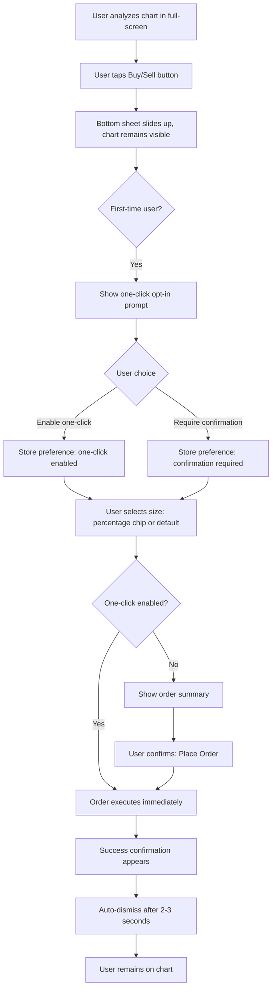
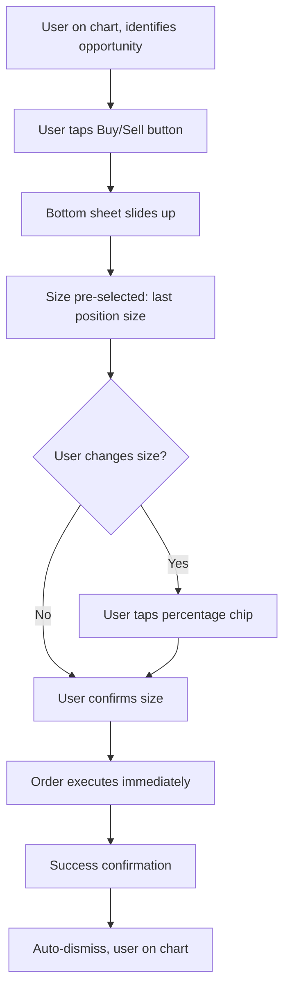
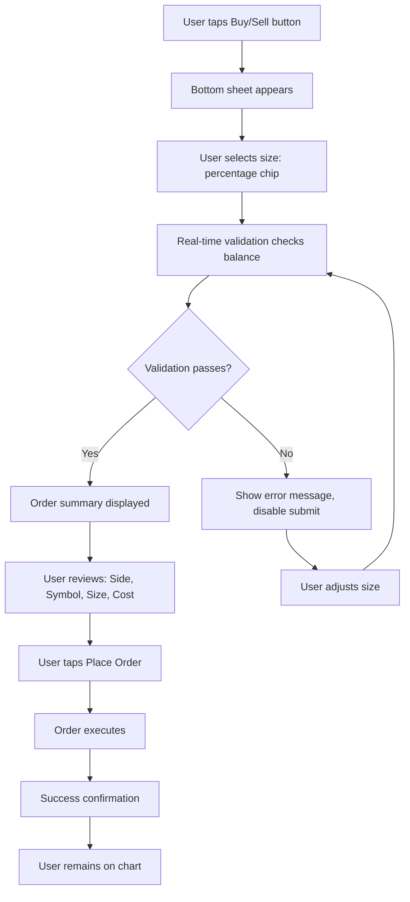
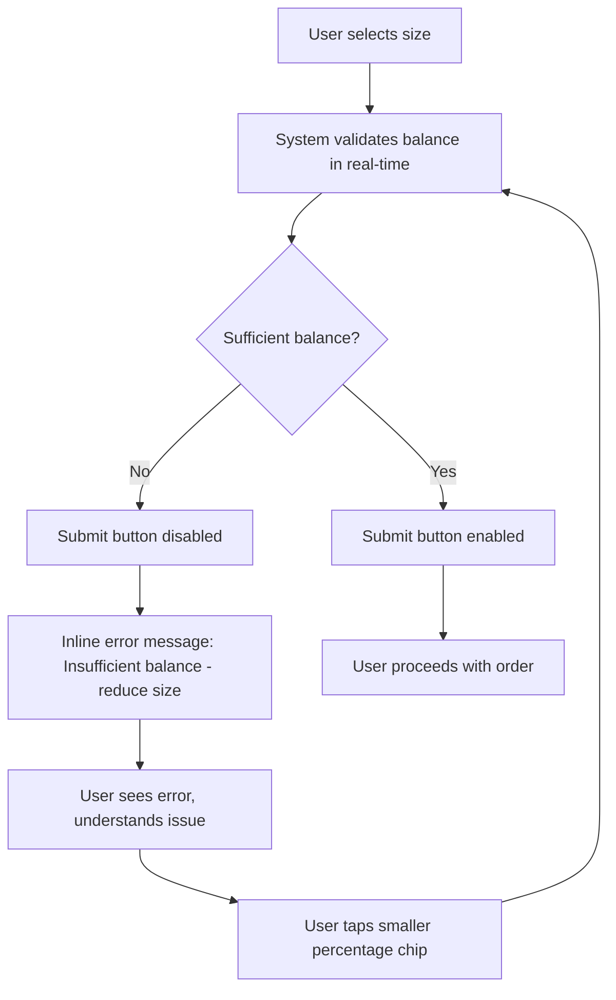

# UX Design Specification BMAD-METHOD

**Author:** Amit.hochma
**Date:** 2026-01-22

---

## Executive Summary

### Project Vision

**Trade From Chart - Market Order (Mobile)** enables seamless market order execution directly from the full-screen chart context on mobile devices. The core vision is to eliminate screen rotation friction that currently breaks chart analysis context, allowing active traders to execute orders while maintaining visual connection to price movements and chart patterns.

The product transforms the mobile trading experience by preserving chart visibility throughout the order placement flow, enabling one-click execution after opt-in confirmation, and providing quick size selection through percentage-based chips (25%/50%/75%/100%).

### Target Users

**Primary User: Alex - The Power Day Trader**

- **Profile:** Active day trader who relies on chart analysis for trading decisions
- **Trading Frequency:** Daily, multiple trades per session
- **Experience Level:** Intermediate to advanced
- **Devices:** Both iOS and Android (requires consistent cross-platform experience)
- **Trading Style:** Day trading with focus on technical analysis
- **Instrument Portfolio:** Trades up to 15 different instruments, varies based on market opportunities

**Key User Characteristics:**
- Uses full-screen chart view as primary workspace for technical analysis
- Needs to act quickly on chart signals and market movements
- Values speed and efficiency in order execution
- Currently frustrated by screen rotation that breaks chart context
- Wants to maintain visual connection to market movements during order placement

### Key Design Challenges

1. **Context Preservation**
   - Maintain chart visibility during order entry (no screen rotation)
   - Keep 50-70% of chart visible while bottom sheet is open
   - Ensure real-time price updates remain visible during order configuration

2. **Speed vs. Safety Balance**
   - Enable one-click execution for power users (opt-in)
   - Provide confirmation option for risk-averse users
   - Real-time validation to prevent errors without slowing down flow

3. **Mobile-First Interaction Design**
   - Optimize for one-hand use (thumb-reach zone)
   - Touch-friendly interface (minimum 44×44pt touch targets)
   - Gesture support (swipe-down to dismiss)
   - Smooth animations that work on mid-range devices

4. **Size Selection UX**
   - Quick percentage-based selection (25%/50%/75%/100%)
   - Default to last position size per instrument
   - Visual feedback on chip selection
   - Real-time balance/margin validation

### Design Opportunities

1. **Competitive Differentiation**
   - One-click execution after opt-in (faster than most competitors)
   - Chart context preservation (unique advantage over current implementation)
   - Smart defaults using last position size with quick percentage adjustments

2. **User Delight Moments**
   - "Aha!" moment when users realize they got into the market super fast without losing chart context
   - Relief from eliminating screen rotation friction
   - Confidence from maintaining visual connection to market movements
   - Empowerment through one-click execution enabling faster trading decisions

3. **Mobile-Native Patterns**
   - Bottom sheet overlay pattern (industry-standard, proven)
   - Percentage chips for fast size selection (faster than manual input)
   - Swipe gestures for dismissal and interaction

---

## Core User Experience

### Defining Experience

**The Core Interaction:** "Tap Buy/Sell on chart → Select size → Execute order instantly, all while staying on the chart."

The defining experience is the seamless flow from chart analysis to order execution without losing visual connection to the market. Users tap Buy/Sell buttons visible on the chart, a bottom sheet slides up preserving chart visibility, they quickly select position size using percentage chips, and the order executes immediately (if one-click enabled) or after confirmation.

**Core User Action:** Execute market orders from chart context in 3-5 seconds (down from 8-12 seconds) without screen rotation or context loss.

### Platform Strategy

**Mobile-First Native Apps:**
- iOS 15+ (native iOS app)
- Android API 24+ (native Android app)
- Cross-platform consistency required
- Feature parity across both platforms

**Platform-Specific Considerations:**
- Touch-based interactions (no mouse/keyboard)
- Gesture support (swipe-down to dismiss)
- One-hand use optimization (thumb-reach zone)
- Portrait mode for MVP (responsive to device orientation)
- Network-dependent (order submission requires connection)
- Real-time price updates via market data feed

**Device Capabilities:**
- Haptic feedback for key actions (optional in MVP)
- Smooth animations (60fps on mid-range devices)
- Secure storage for user preferences
- No additional device permissions required

### Effortless Interactions

1. **One-Tap Size Selection**
   - Percentage chips (25%/50%/75%/100%) enable instant size selection
   - Default to last position size eliminates need to think
   - Visual feedback confirms selection immediately

2. **One-Click Execution (After Opt-In)**
   - For users who enable one-click: Order executes immediately after size selection
   - No confirmation step needed for repeat users
   - Balances speed with safety through opt-in mechanism

3. **Chart Context Preservation**
   - Chart remains visible throughout entire order flow
   - No screen rotation eliminates cognitive overhead
   - Real-time price updates continue during order entry

4. **Smart Defaults**
   - Last position size automatically used as default
   - Order side (Buy/Sell) prefilled based on button tapped
   - Market price auto-filled (not editable for Market orders)

### Critical Success Moments

1. **Discovery Moment**
   - User taps Buy/Sell button on chart
   - Bottom sheet slides up WITHOUT screen rotation
   - User realizes chart is still visible - "This is different!"

2. **Speed Realization**
   - User selects size and order executes in seconds
   - User notices time-to-execution is 3-5 seconds vs. previous 8-12 seconds
   - "I got into the market super fast!"

3. **Context Preservation Aha**
   - User maintains visual connection to price movements throughout order placement
   - User can monitor chart while configuring order
   - "I never lost sight of the chart - this is exactly what I needed!"

4. **Confidence Building**
   - User successfully places multiple orders without context loss
   - User feels more confident in timing decisions
   - User increases trading frequency due to reduced friction

### Experience Principles

1. **Context is King**
   - Chart visibility is non-negotiable during order entry
   - No screen rotation or context switching
   - Real-time market data remains accessible

2. **Speed with Safety**
   - Enable fast execution for power users (one-click opt-in)
   - Provide safety mechanisms for risk-averse users (confirmation option)
   - Real-time validation prevents errors without slowing flow

3. **Mobile-Native First**
   - Touch-optimized interactions
   - Gesture-friendly patterns
   - One-hand use considerations
   - Thumb-reach zone optimization

4. **Progressive Disclosure**
   - Simple for Market Orders (primary use case)
   - Advanced options available but not required
   - Quick path for 80% of users, full path for 20%

5. **Visual Clarity**
   - Color coding (green for Buy, red for Sell)
   - Clear visual feedback for all actions
   - Inline error messages with recovery guidance
   - Success confirmation with auto-dismiss

---

## Desired Emotional Response

### Primary Emotional Goals

**Empowerment and Control**
Users should feel empowered to act quickly on trading opportunities without losing control or context. The experience should make users feel like they're in command of their trading decisions, with the tool enabling rather than constraining their actions.

**Confidence and Trust**
Users should feel confident in their timing decisions because they maintain visual connection to market movements. The system should build trust through real-time validation, clear feedback, and reliable execution.

**Relief and Efficiency**
Users should experience relief from eliminating the frustrating screen rotation friction. The experience should feel efficient and streamlined, reducing cognitive overhead and enabling faster decision-making.

### Emotional Journey Mapping

**First Discovery:**
- **Curiosity** → User notices Buy/Sell button behavior is different
- **Surprise** → Bottom sheet appears without screen rotation
- **Relief** → Chart remains visible - "This is better!"

**First Execution:**
- **Anticipation** → User selects size and prepares for execution
- **Confidence** → Real-time validation confirms order is valid
- **Satisfaction** → Order executes quickly, user remains on chart
- **Delight** → "I got into the market super fast without losing context!"

**Returning User (One-Click Enabled):**
- **Efficiency** → Fast execution feels natural and effortless
- **Empowerment** → User feels in control and able to act quickly
- **Confidence** → Repeated success builds trust in the system

**Error Recovery:**
- **Clarity** → Clear error messages explain the issue
- **Guidance** → Recovery path is obvious and actionable
- **Confidence** → System prevents errors, user feels protected

### Micro-Emotions

**Critical Positive States:**
- **Confidence** vs. Confusion - Clear visual feedback and real-time validation build confidence
- **Trust** vs. Skepticism - Reliable execution and error prevention build trust
- **Efficiency** vs. Frustration - Fast execution and context preservation create efficiency
- **Control** vs. Helplessness - User maintains control through opt-in choices and clear options

**Emotions to Avoid:**
- **Anxiety** - Prevented through real-time validation and clear error messages
- **Frustration** - Eliminated by removing screen rotation and reducing steps
- **Confusion** - Avoided through clear visual hierarchy and intuitive interactions
- **Regret** - Minimized through confirmation option and validation

### Design Implications

**Empowerment → UX Choices:**
- Opt-in one-click execution (user controls speed vs. safety)
- Quick size selection (user acts fast when ready)
- Chart context preservation (user maintains control of their analysis)

**Confidence → UX Choices:**
- Real-time validation with clear feedback
- Visual confirmation of order details
- Success messages that confirm execution
- Error messages with actionable recovery paths

**Efficiency → UX Choices:**
- Percentage chips for instant size selection
- Default to last position size (eliminates thinking)
- One-click execution for repeat users
- Smooth animations that feel fast (300-400ms)

**Relief → UX Choices:**
- No screen rotation (eliminates primary friction)
- Chart remains visible (maintains context)
- Quick execution (reduces waiting time)
- Clear visual feedback (reduces uncertainty)

### Emotional Design Principles

1. **Transparency Builds Trust**
   - Show real-time price updates
   - Display order details clearly
   - Provide immediate validation feedback

2. **Speed Creates Delight**
   - Minimize steps to execution
   - Enable one-click for power users
   - Smooth animations that feel instant

3. **Control Reduces Anxiety**
   - Opt-in mechanisms (not forced)
   - Clear options at each step
   - Easy recovery from errors

4. **Clarity Prevents Confusion**
   - Visual hierarchy guides attention
   - Color coding (green/red) is universal
   - Inline error messages with guidance

---

## UX Pattern Analysis & Inspiration

### Inspiring Products Analysis

**TradingView (Chart-First Platform)**
- **Strengths:** Deep chart integration, bottom sheet preserves chart visibility, percentage chips for sizing, single-tap execution
- **Key Pattern:** Trading panel overlays chart (60-70% screen height), chart remains visible and interactive
- **Transferable:** Bottom sheet pattern, percentage-based sizing, chart-preserving approach

**Binance (Crypto Trading)**
- **Strengths:** Fastest Market Order execution (2-3 taps), "Max" button for instant sizing, chart preserved during order entry
- **Key Pattern:** Slide-up panel (50% height), chart top 50% visible, percentage chips + "Max" button
- **Transferable:** "Max" button concept, thin bottom sheet approach, fastest execution pattern

**eToro (Social Trading)**
- **Strengths:** Integrated panel below chart (not overlay), percentage chips (10/25/50/100%), fastest execution (3 taps)
- **Key Pattern:** Trading panel as part of chart page layout, chart always visible, no gesture needed
- **Transferable:** Percentage-based sizing, integrated panel concept, fast execution flow

**Robinhood (Beginner-Friendly)**
- **Strengths:** Swipe-to-confirm gesture, simple and clear UX, large touch targets
- **Key Pattern:** Swipe gesture for confirmation, beginner-friendly approach
- **Transferable:** Swipe gesture concept (optional safety mechanism), simple visual hierarchy

### Transferable UX Patterns

**Navigation Patterns:**
- **Bottom Sheet Overlay** - Universal pattern used by all competitors, preserves chart visibility, gesture-friendly
- **Floating Action Buttons** - Persistent Buy/Sell buttons on chart, always accessible, doesn't interfere with analysis

**Interaction Patterns:**
- **Percentage Chips for Sizing** - Faster than manual input, retail-friendly, visual and intuitive
- **Single-Tap Submission** - Standard for Market Orders, speed-optimized, can be toggled for safety
- **Swipe-to-Dismiss** - Standard iOS/Android pattern, intuitive gesture, reduces accidental taps

**Visual Patterns:**
- **Color-Coded Buy/Sell** - Green/Red universal language, consistent throughout flow, reduces cognitive load
- **Collapsible Advanced Options** - Keeps Market Order flow fast, progressive disclosure, doesn't overwhelm

**Mobile-First Patterns:**
- **Chart Preserved Behind Panel** - 50% chart visibility during order entry, users see price movement, reduces context loss
- **Thumb-Reach Zone Optimization** - Primary actions in bottom third, one-hand use, touch-friendly targets

### Anti-Patterns to Avoid

1. **Full Screen Replacement**
   - **Avoid:** Completely covering chart during order entry (like Robinhood)
   - **Better:** Preserve chart visibility (Binance, eToro pattern)

2. **Confirmation for Every Market Order**
   - **Avoid:** Requiring double-tap for all Market Orders (slows down 80% of trades)
   - **Better:** Optional confirmation toggle (TradingView approach)

3. **Desktop-First Mobile UX**
   - **Avoid:** Porting desktop interface to mobile (MT4/MT5, IBKR)
   - **Better:** Mobile-native design (Binance, Robinhood)

4. **Complexity by Default**
   - **Avoid:** Showing all options always (IBKR, MT4/MT5)
   - **Better:** Progressive disclosure (TradingView, Binance)

5. **Manual Input Only**
   - **Avoid:** No quick presets (MT4/MT5 lot-based only)
   - **Better:** Percentage chips + manual input option

### Design Inspiration Strategy

**What to Adopt:**
- **Bottom Sheet Pattern** - Industry standard, preserves chart visibility, gesture-friendly
- **Percentage Chips (25/50/75/100%)** - Faster than manual input, retail-friendly, proven pattern
- **Chart Preservation (50/50 Split)** - Users see price movement, reduces context loss, builds confidence
- **Single-Tap Execution (Opt-In)** - Speed for power users, safety through opt-in mechanism

**What to Adapt:**
- **"Max" Button Concept** - Adapt from Binance for instant 100% sizing (post-MVP enhancement)
- **Swipe-to-Confirm** - Adapt from Robinhood as optional safety mechanism (not default)
- **Integrated Panel** - Consider as alternative to bottom sheet for future A/B testing

**What to Avoid:**
- **Full Screen Replacement** - Conflicts with context preservation goal
- **Forced Confirmation** - Doesn't fit speed optimization goal
- **Desktop Port** - Doesn't fit mobile-first approach
- **Complexity by Default** - Conflicts with effortless interaction goal

---

## Design System Foundation

### Design System Choice

**Recommended: Custom Design System with Mobile Component Library**

**Rationale:**
- Mobile-native trading apps require specialized components (bottom sheets, percentage chips, order entry panels)
- Existing design systems (Material Design, Ant Design) are web-first and don't fully support mobile trading patterns
- Fintech domain requires specific components (price displays, order summaries, validation states)
- Need for brand differentiation in competitive trading space
- Custom system allows for mobile-first patterns and trading-specific interactions

**Implementation Approach:**
- Build on established mobile design principles (iOS Human Interface Guidelines, Material Design for Mobile)
- Create custom components for trading-specific needs (order entry bottom sheet, percentage chips, price displays)
- Use design tokens from established systems (spacing, typography scale, color semantics)
- Ensure accessibility compliance (WCAG 2.1 AA) from the start

### Customization Strategy

**Foundation Components (Adopt from Standards):**
- Buttons, Inputs, Typography, Spacing, Colors (from Material Design or iOS HIG)
- Bottom Sheet component (iOS/Android native patterns)
- Touch targets, Gestures, Animations (platform-specific best practices)

**Custom Components (Build for Trading):**
- Order Entry Bottom Sheet (trading-specific layout and interactions)
- Percentage Size Chips (25/50/75/100% quick selector)
- Price Display Component (real-time updates, formatting)
- Order Summary Component (side, symbol, size, cost display)
- Validation States (balance/margin checks, inline errors)
- Success Confirmation (order execution feedback)

**Design Token Strategy:**
- Color: Semantic mapping (primary, success, error, warning) + trading-specific (buy green, sell red)
- Typography: Mobile-optimized scale, financial data formatting
- Spacing: 8px base unit, optimized for touch targets
- Animation: 300-400ms for bottom sheet, 100-200ms for micro-interactions

---

## 2. Core User Experience

### 2.1 Defining Experience

**The Core Interaction:** "One-tap order execution from chart while staying on chart."

Users analyze charts in full-screen view, identify trading opportunities, tap Buy/Sell buttons visible on chart, bottom sheet slides up preserving chart visibility, user selects size using percentage chips (or uses default), and order executes immediately (if one-click enabled) or after confirmation - all without leaving the chart context.

**Success Definition:** Users execute market orders in 3-5 seconds (down from 8-12 seconds) while maintaining visual connection to price movements and chart patterns throughout the entire flow.

### 2.2 User Mental Model

**Current Mental Model:**
- Users expect to leave chart when placing orders (current implementation reinforces this)
- Users mentally prepare for context loss and screen rotation
- Users accept that order placement breaks their analysis flow

**Desired Mental Model:**
- Users expect to stay on chart while placing orders
- Users maintain continuous visual connection to market
- Users feel chart and order entry are integrated, not separate

**Mental Model Transition:**
- First-time users discover chart-preserving behavior (surprise and delight)
- Returning users develop new mental model (chart + order = integrated experience)
- Power users with one-click enabled feel like order execution is part of chart interaction

### 2.3 Success Criteria

**Core Experience Success Indicators:**

1. **Speed Achievement**
   - Users complete orders in 3-5 seconds (50%+ faster than current)
   - Users feel the speed improvement immediately
   - Time-to-execution reduction is noticeable and measurable

2. **Context Preservation**
   - 100% of orders placed without screen rotation
   - Chart remains visible throughout order placement
   - Users maintain visual connection to market movements

3. **User Confidence**
   - Users report feeling more confident in timing decisions
   - Users feel in control during order placement
   - Users trust the system through real-time validation

4. **Efficiency Realization**
   - Users place more orders through chart than other entry points
   - Users increase trading frequency due to reduced friction
   - Users return to chart trading as primary method

### 2.4 Novel UX Patterns

**Novel Combination:**
- **Chart-Preserving Bottom Sheet** - While bottom sheets are common, preserving 50% chart visibility during order entry is less common
- **One-Click Opt-In Trading** - Opt-in one-click execution (not forced) balances speed with safety uniquely
- **Percentage Chips with Last Position Default** - Smart defaults combined with quick percentage adjustments create efficient sizing

**Established Patterns Used:**
- Bottom sheet overlay (iOS/Android standard)
- Percentage-based sizing (retail trading standard)
- Color-coded Buy/Sell (universal trading language)
- Swipe-to-dismiss gesture (mobile standard)

**Education Approach:**
- First-time users see one-click opt-in prompt with explanation
- Visual discovery (bottom sheet behavior is self-evident)
- Progressive disclosure (simple for Market Orders, advanced options available)

### 2.5 Experience Mechanics

**1. Initiation:**
- **Trigger:** User taps Buy/Sell button visible on full-screen chart
- **System Response:** Bottom sheet slides up from bottom (300-400ms animation)
- **Chart State:** Chart remains visible in top 30-50% of screen, continues updating in real-time
- **Visual Feedback:** Backdrop dimming (40-60% opacity) indicates modal state

**2. Interaction:**
- **Order Side:** Prefilled based on button tapped (Buy = green, Sell = red)
- **Size Selection:** User taps percentage chip (25%/50%/75%/100%) or uses default (last position size)
- **Price Display:** Current market price shown, auto-filled, updates in real-time
- **Validation:** Real-time balance/margin check, submit button enables/disables accordingly

**3. Feedback:**
- **Visual:** Selected chip highlighted, price updates in real-time, validation state clear
- **Haptic:** Optional haptic feedback on chip selection (post-MVP)
- **Error:** Inline error messages if validation fails, clear recovery guidance
- **Success:** Brief success message after execution, auto-dismiss after 2-3 seconds

**4. Completion:**
- **One-Click Enabled:** Order executes immediately after size selection
- **Confirmation Required:** User reviews order summary, taps "Place Order" to confirm
- **Success State:** Order confirmation appears, user remains on chart
- **Return:** Bottom sheet dismisses, user continues chart analysis

---

## Visual Design Foundation

### Color System

**Primary Colors:**
- **Buy (Green):** #00C853 or equivalent (success, positive action)
- **Sell (Red):** #F44336 or equivalent (error, negative action)
- **Primary Action:** Brand primary color (for submit buttons, key actions)
- **Neutral Background:** #FFFFFF (light mode), #121212 (dark mode support post-MVP)

**Semantic Color Mapping:**
- **Success:** Green (#00C853) - Order execution success, validation passed
- **Error:** Red (#F44336) - Validation failed, insufficient balance
- **Warning:** Orange/Amber - Price slippage warnings, high leverage (post-MVP)
- **Info:** Blue - Informational messages, help text
- **Neutral:** Gray scale - Backgrounds, borders, secondary text

**Accessibility Compliance:**
- Text contrast: 4.5:1 minimum for normal text (WCAG AA)
- Large text contrast: 3:1 minimum for large text (18pt+)
- Color not sole indicator: Icons and text accompany color coding
- High contrast mode support (post-MVP)

### Typography System

**Primary Typeface:**
- **iOS:** San Francisco (SF Pro) - System font, optimized for iOS
- **Android:** Roboto or system font - Native Android font
- **Rationale:** System fonts ensure consistency, performance, and accessibility

**Type Scale:**
- **H1 (Chart Title):** 24pt, Bold - Instrument name, major headings
- **H2 (Section Headers):** 20pt, Semibold - Order entry sections
- **H3 (Subsection):** 18pt, Medium - Component labels
- **Body (Primary Text):** 16pt, Regular - Order details, descriptions
- **Body Small (Secondary):** 14pt, Regular - Helper text, captions
- **Price Display:** 28pt, Bold - Large, prominent price display
- **Button Text:** 16pt, Semibold - Clear, readable button labels

**Typography Principles:**
- **Financial Data:** Monospace font for numbers (prices, sizes) for alignment
- **Readability:** Minimum 16pt for body text on mobile
- **Hierarchy:** Clear size and weight differences guide attention
- **Line Height:** 1.5x for body text, 1.2x for headings

### Spacing & Layout Foundation

**Spacing System:**
- **Base Unit:** 8px (standard mobile spacing)
- **Scale:** 4px, 8px, 12px, 16px, 24px, 32px, 48px
- **Component Spacing:** 16px between major elements, 8px between related elements
- **Touch Target Spacing:** Minimum 8px between interactive elements

**Layout Principles:**
- **Mobile-First:** Design for smallest screen first, scale up
- **Thumb-Reach Zone:** Primary actions in bottom third of screen
- **Content Density:** Balanced - not too dense (overwhelming) or too sparse (inefficient)
- **Visual Hierarchy:** Clear primary, secondary, tertiary action hierarchy

**Grid System:**
- **Bottom Sheet Width:** Full width on mobile
- **Content Padding:** 16px horizontal, 24px vertical
- **Component Alignment:** Left-aligned text, centered buttons, right-aligned prices
- **Chart Area:** Top 30-50% of screen, full width

### Accessibility Considerations

**Color Contrast:**
- All text meets WCAG AA standards (4.5:1 for normal, 3:1 for large)
- Color coding supplemented with icons and text labels
- High contrast mode support (post-MVP)

**Touch Targets:**
- Minimum 44×44pt (iOS) / 48×48dp (Android) for all interactive elements
- Percentage chips sized for easy tapping
- Submit button large and prominent

**Screen Reader Support:**
- Semantic HTML structure
- ARIA labels for all interactive elements
- Descriptive button labels ("Buy 0.5 contracts" not just "Buy")
- Order summary announced clearly

**Keyboard Navigation:**
- Tab order logical and intuitive
- Focus indicators visible and clear
- Skip links for main content (if applicable)

---

## Design Direction Decision

### Design Directions Explored

**Direction 1: Minimal Bottom Sheet (Binance-Inspired)**
- Thin bottom sheet (50% height), chart 50% visible
- Minimal UI elements, focus on speed
- Percentage chips prominent, "Max" button concept
- Fast execution, less visual weight

**Direction 2: Integrated Panel (eToro-Inspired)**
- Trading panel as part of chart page layout
- Chart always visible, no overlay
- More native feel, less gesture-dependent
- Better for users who prefer persistent controls

**Direction 3: Standard Bottom Sheet (TradingView-Inspired)**
- Standard bottom sheet (60-70% height), chart 30-40% visible
- More space for order details and options
- Balanced approach, industry standard
- Good for users who want more information visible

### Chosen Direction

**Portrait:** Direction 3: Standard Bottom Sheet with Chart Preservation
**Landscape:** Direction 4: On-Chart Execution Widget

**Rationale:**
- **Portrait:** Bottom sheet is standard for vertical layouts.
- **Landscape:** Vertical space is scarce. A "Bottom Sheet" would obscure the entire chart.
- **Widget Strategy:** A compact, semi-transparent overlay docked to the side (left/right configurable or fixed right).
- **Consistency:** Both modes share the same "One-Click" logic, but the UI container adapts to the orientation.

**Key Elements:**
- **Bottom sheet (Portrait):** Height 60-70% of screen, Chart 30-40% visible.
- **Widget (Landscape):** Compact panel, Always visible (or togglable).
- **Animations:** Smooth slide-up (Portrait) vs. Fade-in/Slide-in (Landscape).
- **Gestures:** Swipe-to-dismiss (Portrait).

### Design Rationale

**Why This Direction:**
1. **User Familiarity** - Bottom sheet is universal mobile pattern, users understand it immediately
2. **Chart Preservation** - 30-40% chart visibility maintains context while providing order entry space
3. **Flexibility** - Can show more or less content as needed (MVP vs. future features)
4. **Performance** - Standard pattern optimized by platform, smooth animations guaranteed
5. **Accessibility** - Standard pattern has built-in accessibility support

**Implementation Approach:**
- Use native bottom sheet components (iOS UISheetPresentationController, Android BottomSheet)
- Customize for trading-specific content (order entry layout, percentage chips)
- Ensure chart rendering continues in reduced space
- Optimize animations for 60fps on mid-range devices

---

## User Journey Flows

### Journey 1: First-Time User - Discovery and Opt-In

**Key Interaction Points:**
- **Entry:** Buy/Sell button tap on chart
- **Discovery:** Bottom sheet behavior (no screen rotation)
- **Decision:** One-click opt-in choice
- **Action:** Size selection and execution
- **Feedback:** Success confirmation
- **Return:** Chart view maintained

### Journey 2: Returning User - One-Click Enabled (Happy Path)

**Key Interaction Points:**
- **Speed:** 2-3 taps total (button → chip → execute)
- **Efficiency:** Default size eliminates thinking
- **Confidence:** Real-time validation ensures order is valid
- **Context:** Chart visible throughout entire flow

### Journey 3: Returning User - Confirmation Required

**Key Interaction Points:**
- **Safety:** Confirmation step provides review opportunity
- **Validation:** Real-time checks prevent errors
- **Recovery:** Clear error messages guide adjustment
- **Context:** Chart remains visible during confirmation

### Journey 4: Error Recovery - Insufficient Balance

**Key Interaction Points:**
- **Prevention:** Real-time validation prevents submission
- **Clarity:** Error message explains issue clearly
- **Guidance:** Message suggests action (reduce size)
- **Recovery:** Easy adjustment without leaving flow

### Journey Patterns

**Common Patterns Across Journeys:**

1. **Chart Preservation Pattern**
   - Chart always visible (30-50% of screen)
   - Real-time updates continue
   - No screen rotation or context loss

2. **Progressive Disclosure Pattern**
   - Simple for Market Orders (primary use case)
   - Advanced options available but not required
   - One-click opt-in for power users

3. **Real-Time Validation Pattern**
   - Validation happens as user interacts
   - Immediate feedback (enabled/disabled states)
   - Clear error messages with recovery guidance

4. **Smart Default Pattern**
   - Last position size as default
   - Order side prefilled from button
   - Market price auto-filled

### Flow Optimization Principles

1. **Minimize Steps to Value**
   - One-click users: 2-3 taps to execution
   - Confirmation users: 4-5 taps to execution
   - Eliminate unnecessary steps

2. **Reduce Cognitive Load**
   - Visual hierarchy guides attention
   - Color coding (green/red) is universal
   - Clear labels and feedback

3. **Provide Clear Feedback**
   - Visual: Selected chips highlighted, buttons enabled/disabled
   - Text: Inline error messages, success confirmations
   - Timing: Immediate validation, fast execution

4. **Handle Edge Cases Gracefully**
   - Insufficient balance: Clear error with recovery path
   - Network errors: Appropriate error messages
   - Validation failures: Inline guidance

---

## Component Strategy

### Design System Components

**Available from Mobile Design Standards:**
- **Buttons:** Primary, Secondary, Text buttons (iOS/Android native)
- **Input Fields:** Text inputs, number inputs (with keyboard types)
- **Bottom Sheet:** Native bottom sheet components (iOS UISheetPresentationController, Android BottomSheet)
- **Typography:** System fonts with established scales
- **Spacing:** Standard spacing systems (8px base)
- **Colors:** Semantic color systems (primary, success, error, etc.)

**Platform-Specific Components:**
- **iOS:** UISheetPresentationController, UIButton, UITextField, UISegmentedControl
- **Android:** BottomSheet, MaterialButton, TextInputLayout, ChipGroup

### Custom Components

**1. Order Entry Bottom Sheet**
- **Purpose:** Trading-specific order entry interface that preserves chart visibility
- **Content:** Order side toggle, size selector, price display, submit button
- **Actions:** Size selection, order confirmation, dismissal
- **States:** Default, size selected, validating, error, submitting, success
- **Variants:** One-click enabled (minimal), confirmation required (with summary)
- **Accessibility:** ARIA labels, keyboard navigation, screen reader support

**2. Percentage Size Chips**
- **Purpose:** Quick size selection using percentage of last position (25%/50%/75%/100%)
- **Content:** Four chip buttons with percentage labels
- **Actions:** Tap to select size, visual feedback on selection
- **States:** Default, selected, disabled (if insufficient balance)
- **Variants:** Standard chips, could add "Max" button (post-MVP)
- **Accessibility:** Clear labels, keyboard navigation, selected state announced

**3. Price Display Component**
- **Purpose:** Real-time market price display with formatting
- **Content:** Current market price, updates in real-time
- **Actions:** Display only (not editable for Market orders)
- **States:** Default, updating, error (if feed unavailable)
- **Variants:** Large display for prominence, formatted for currency/instrument
- **Accessibility:** Live region for screen readers, clear price announcement

**4. Order Summary Component**
- **Purpose:** Display order details before confirmation (for non-one-click users)
- **Content:** Side (Buy/Sell), Symbol, Size, Estimated cost
- **Actions:** Review and confirm
- **States:** Default, confirming
- **Variants:** Minimal for one-click, detailed for confirmation
- **Accessibility:** Clear structure, all details announced

**5. Validation State Component**
- **Purpose:** Real-time balance/margin validation with feedback
- **Content:** Validation status, error messages if failed
- **Actions:** Disable/enable submit button, show inline errors
- **States:** Validating, valid, invalid (with specific error)
- **Variants:** Inline errors, button state changes
- **Accessibility:** Error messages announced, focus management

**6. Success Confirmation Component**
- **Purpose:** Brief confirmation after order execution
- **Content:** Success message, order details
- **Actions:** Auto-dismiss after 2-3 seconds
- **States:** Showing, dismissing
- **Variants:** Toast notification style
- **Accessibility:** Success announced, auto-dismiss with option to extend

### Component Implementation Strategy

**Foundation Components:**
- Use native platform components where possible (buttons, inputs, bottom sheets)
- Customize with design tokens (colors, typography, spacing)
- Ensure platform consistency while allowing platform-specific optimizations

**Custom Components:**
- Build using design system tokens (colors, spacing, typography)
- Follow platform-specific patterns (iOS Human Interface Guidelines, Material Design)
- Ensure accessibility from the start (ARIA labels, keyboard navigation, screen reader support)
- Optimize for performance (smooth animations, efficient rendering)

**Reusability:**
- Percentage chips reusable for other sizing scenarios
- Order summary component reusable for order review flows
- Validation component reusable for all form validation
- Success confirmation reusable for all success states

### Implementation Roadmap

**Phase 1 - Core Components (MVP):**
- Order Entry Bottom Sheet - Critical for core experience
- Percentage Size Chips - Essential for quick sizing
- Price Display Component - Essential for order entry
- Validation State Component - Critical for error prevention
- Success Confirmation Component - Essential for user feedback

**Phase 2 - Supporting Components (Post-MVP):**
- Order Summary Component enhancements (for Limit/Stop orders)
- Advanced options section (TP/SL inputs)
- Quote lock timer component (post-MVP feature)

**Phase 3 - Enhancement Components (Future):**
- Position awareness component (current position display)
- Order templates component
- Smart defaults component (ML-based suggestions)

---

## UX Consistency Patterns

### Button Hierarchy

**Primary Actions:**
- **Submit/Place Order Button:** Large, prominent, color-coded (green for Buy, red for Sell)
- **Size:** Minimum 48dp height, full width in bottom sheet
- **State:** Enabled (valid order), Disabled (validation failed), Loading (submitting)
- **Placement:** Bottom of bottom sheet, within thumb-reach zone

**Secondary Actions:**
- **Percentage Chips:** Medium size, clear labels, visual feedback on selection
- **Dismiss/Cancel:** Text button or swipe gesture, less prominent
- **Settings/Preferences:** Icon button, accessible but not primary

**Visual Hierarchy:**
- Primary action: Highest visual weight (color, size, position)
- Secondary actions: Medium weight (chips, toggles)
- Tertiary actions: Lowest weight (dismiss, settings)

### Feedback Patterns

**Success Feedback:**
- **Visual:** Green checkmark icon, success message
- **Text:** "Order placed successfully" with order details
- **Timing:** Appears immediately after execution, auto-dismiss after 2-3 seconds
- **Location:** Top of bottom sheet or toast notification

**Error Feedback:**
- **Visual:** Red error icon, inline error message
- **Text:** Clear explanation of issue ("Insufficient balance - reduce size")
- **Action:** Guidance on how to fix ("Select a smaller size")
- **Location:** Inline with relevant input, submit button disabled

**Warning Feedback:**
- **Visual:** Orange/amber warning icon (post-MVP for price slippage)
- **Text:** Warning message with context
- **Action:** User can proceed or adjust
- **Location:** Prominent but not blocking

**Info Feedback:**
- **Visual:** Blue info icon, subtle styling
- **Text:** Helpful information or tips
- **Location:** Contextual to relevant element

### Form Patterns

**Input Validation:**
- **Real-Time:** Validation happens as user interacts
- **Inline Errors:** Error messages appear below/next to input
- **Visual States:** Valid (green checkmark), Invalid (red error), Neutral (default)
- **Submit Prevention:** Submit button disabled until all validation passes

**Input Types:**
- **Percentage Chips:** Primary input method for size selection
- **Manual Input:** Post-MVP option for precise sizing
- **Price Display:** Read-only, auto-filled, real-time updates

**Form Layout:**
- **Vertical Stack:** Order side → Size selection → Price display → Submit
- **Spacing:** 16px between major sections, 8px between related elements
- **Alignment:** Left-aligned labels, full-width inputs, centered submit button

### Navigation Patterns

**Chart to Order Entry:**
- **Trigger:** Buy/Sell button tap on chart
- **Transition:** Bottom sheet slides up (300-400ms)
- **Return:** Swipe-down gesture or tap outside (dismisses bottom sheet)

**Within Order Entry:**
- **No Navigation:** All order entry happens within bottom sheet
- **Progressive Disclosure:** Advanced options in collapsible section (post-MVP)
- **State Management:** Clear current state (size selected, validating, etc.)

**Order to Chart:**
- **After Execution:** Success confirmation → auto-dismiss → return to chart
- **After Cancellation:** Swipe-down or tap outside → return to chart
- **No Navigation Required:** Chart always accessible, no back button needed

### Additional Patterns

**Loading States:**
- **Order Submission:** Submit button shows loading spinner, disabled during submission
- **Price Updates:** Subtle loading indicator if price feed delayed
- **Validation:** Instant feedback (no loading state needed for real-time validation)

**Empty States:**
- **No Last Position:** Default to minimum size or show placeholder
- **No Price Data:** Show "Price unavailable" message, disable submit
- **Network Error:** Show error message with retry option

**Modal Patterns:**
- **Bottom Sheet:** Primary modal pattern for order entry
- **Backdrop:** Dimmed background (40-60% opacity) indicates modal state
- **Dismissal:** Swipe-down gesture (primary), tap outside (secondary)

---

## Responsive Design & Accessibility

### Responsive Strategy

**Mobile-First Approach:**
- **Primary Platform:** Mobile (iOS and Android native apps)
- **Design Priority:** Mobile experience is primary, not adapted from desktop
- **Screen Sizes:** iPhone SE (smallest) to iPhone Pro Max / large Android devices
- **Orientation:** Portrait mode for MVP (landscape support post-MVP)

**Device-Specific Considerations:**
- **Small Screens (iPhone SE):** Bottom sheet may need to be taller (70%) to accommodate content
- **Large Screens (iPhone Pro Max):** Bottom sheet can be shorter (50-60%), more chart visible
- **Tablet Support:** Post-MVP, may use different layout (more horizontal space)

**Chart Adaptation:**
- **Reduced Space:** Chart must render effectively in 30-50% of screen height
- **Real-Time Updates:** Chart continues updating during order entry
- **Touch Interactions:** Chart remains interactive (zoom, pan) in visible area

### Breakpoint Strategy

**Mobile Breakpoints (For Future Responsive Web Version):**
- **Mobile:** 320px - 767px (primary focus for MVP)
- **Tablet:** 768px - 1023px (post-MVP consideration)
- **Desktop:** 1024px+ (post-MVP consideration)

**Current MVP Strategy:**
- **Native Apps:** No breakpoints needed (fixed mobile layouts)
- **Adaptive Layout:** Bottom sheet height adapts to device size and content
- **Content Scaling:** Text and components scale appropriately for device

**Future Considerations:**
- **Tablet Layout:** May use side panel instead of bottom sheet
- **Desktop Layout:** May use modal dialog or inline panel
- **Responsive Web:** Will need breakpoint strategy for web version

### Accessibility Strategy

**WCAG Compliance Level: AA (Recommended)**

**Rationale:**
- Fintech domain requires accessibility for regulatory compliance
- Mobile trading apps serve diverse user base
- WCAG AA is industry standard for good UX
- Achievable without excessive complexity

**Key Accessibility Requirements:**

1. **Color Contrast:**
   - Normal text: 4.5:1 minimum contrast ratio
   - Large text (18pt+): 3:1 minimum contrast ratio
   - Interactive elements: 3:1 minimum contrast ratio
   - Color not sole indicator (icons and text accompany colors)

2. **Touch Targets:**
   - Minimum 44×44pt (iOS) / 48×48dp (Android) for all interactive elements
   - Percentage chips sized appropriately
   - Submit button large and easy to tap
   - Adequate spacing between touch targets (8px minimum)

3. **Screen Reader Support:**
   - Semantic HTML structure (for web version)
   - ARIA labels for all interactive elements
   - Descriptive button labels ("Buy 0.5 contracts" not just "Buy")
   - Order summary announced clearly
   - Error messages announced immediately

4. **Keyboard Navigation:**
   - Logical tab order
   - Focus indicators visible and clear
   - All functionality accessible via keyboard
   - Skip links for main content (if applicable)

5. **Content Accessibility:**
   - Clear headings and structure
   - Alt text for icons (if used)
   - Financial data formatted clearly
   - Error messages clear and actionable

### Testing Strategy

**Responsive Testing:**
- **Device Testing:** Test on actual iOS and Android devices (various screen sizes)
- **Performance Testing:** Ensure smooth animations on mid-range devices
- **Network Testing:** Test on various network conditions (3G, 4G, WiFi)
- **Orientation Testing:** Portrait mode (MVP), landscape (post-MVP)

**Accessibility Testing:**
- **Automated Tools:** Use accessibility testing tools (axe, WAVE, etc.)
- **Screen Reader Testing:** Test with VoiceOver (iOS), TalkBack (Android)
- **Keyboard Testing:** Verify all functionality accessible via keyboard
- **Color Blindness:** Test with color blindness simulators
- **User Testing:** Include users with disabilities in testing (post-MVP)

**User Testing:**
- **Target Users:** Test with power day traders (Alex persona)
- **First-Time Users:** Test discovery and opt-in flow
- **Returning Users:** Test one-click enabled flow
- **Error Scenarios:** Test error recovery flows
- **Device Diversity:** Test on various devices and screen sizes

### Implementation Guidelines

**Responsive Development:**
- **Relative Units:** Use rem, %, vw, vh over fixed pixels where possible
- **Flexible Layouts:** Use flexbox/grid for adaptive layouts
- **Touch Optimization:** Ensure touch targets meet minimum sizes
- **Performance:** Optimize animations for 60fps on mid-range devices
- **Image Optimization:** Optimize assets for different device densities

**Accessibility Development:**
- **Semantic HTML:** Use proper HTML elements (buttons, inputs, etc.)
- **ARIA Labels:** Provide descriptive labels for all interactive elements
- **Focus Management:** Ensure logical focus order and visible focus indicators
- **Error Handling:** Announce errors immediately, provide recovery guidance
- **Testing:** Include accessibility testing in development workflow

**Platform-Specific:**
- **iOS:** Follow Human Interface Guidelines for accessibility
- **Android:** Follow Material Design accessibility guidelines
- **Native Components:** Use platform-native accessible components where possible
- **Custom Components:** Ensure custom components meet accessibility standards

---

## Workflow Completion Summary

**UX Design Specification Complete!**

The comprehensive UX design specification for **Trade From Chart - Market Order (Mobile)** is now complete and ready to guide visual design and implementation.

**Complete Specification Available At:**
`/Users/amit.hochma/BMAD-METHOD/_bmad-output/planning-artifacts/ux-design-specification.md`

**Key Deliverables:**
- ✅ Executive Summary with project vision and target users
- ✅ Core User Experience definition and mechanics
- ✅ Desired Emotional Response and design implications
- ✅ UX Pattern Analysis with competitor insights
- ✅ Design System Foundation and customization strategy
- ✅ Visual Design Foundation (colors, typography, spacing)
- ✅ Design Direction Decision (standard bottom sheet approach)
- ✅ User Journey Flows with Mermaid diagrams
- ✅ Component Strategy with custom component specifications
- ✅ UX Consistency Patterns for common interactions
- ✅ Responsive Design & Accessibility Strategy (WCAG AA)

**Next Steps:**
1. **Wireframe Generation** - Create detailed wireframes based on this specification
2. **Interactive Prototype** - Build clickable prototypes for user testing
3. **Solution Architecture** - Technical architecture design with UX context
4. **Visual Design Implementation** - High-fidelity UI design in Figma or similar

**The specification is ready to guide all design and development work!**
