# Dmitry's Daily Trading Flow - Data Sync Failure Analysis

## User Flow Diagram

## Alternative: Sequence Diagram View

```mermaid
sequenceDiagram
    participant D as Dmitry
    participant M as Mobile<br/>Samsung Fold
    participant HD as Home Desktop<br/>Web App
    participant B as Backend<br/>System
    participant WD as Work Desktop<br/>or Mobile
    
    Note over D,WD: Phase 1: Morning Routine
    D->>M: Checks Asian Session
    M->>D: Market Performance Data
    D->>D: Gains High-Level Awareness
    
    Note over D,WD: Phase 2: Deep Work Setup
    D->>HD: Opens Charts (S&P 500, Gold, Silver)
    D->>HD: Draws Support/Resistance Lines
    D->>HD: Adds Fibonacci Retracements
    D->>HD: Adds Moving Averages
    Note over HD: Mental Model Created<br/>Chart Fully Annotated
    
    Note over D,WD: Phase 3: The Transition (SYNC FAILURE)
    D->>HD: Switches Devices
    HD->>B: Sync Request
    B->>B: ✅ Saves: Positions, Balance
    B-->>HD: ❌ FAILS: Chart Drawings/Annotations
    Note over B: Data Sync Incomplete
    
    Note over D,WD: Phase 4: Execution & Confusion
    D->>WD: Opens Same Asset (S&P 500)
    WD->>B: Request Chart Data
    B->>WD: Returns Clean Chart (No Annotations)
    WD->>D: Shows Naked Chart
    Note over D: Feels Lost & Lacks Confidence
    D->>D: Reconstructs from Memory<br/>OR Trades with Higher Risk
    
    Note over D,WD: Phase 5: Evening Monitoring
    D->>M: Monitors US Market Open
    M->>D: Market Data
    D->>D: Manages Positions<br/>(Based on Invisible Analysis)
```

## Key Insights

### Critical Failure Point
- **Location**: Phase 3 - Device Transition
- **Impact**: Loss of all technical analysis work
- **User Experience**: Complete disruption of workflow and confidence

### Data Sync Gaps
- ✅ **Synced**: Open positions, account balance
- ❌ **NOT Synced**: Chart drawings, annotations, technical analysis layers

### User Impact
- **Cognitive Load**: Forced to reconstruct analysis from memory
- **Risk**: Trading with incomplete information
- **Confidence**: Significant reduction in decision-making confidence
- **Workflow**: Breaks the seamless multi-device experience

### Recommended Solution
Implement comprehensive chart state synchronization:
- Save all drawing objects (lines, shapes, annotations)
- Sync technical indicator configurations
- Preserve chart layouts and zoom levels
- Enable real-time sync across devices
- Add visual indicators when sync is incomplete
